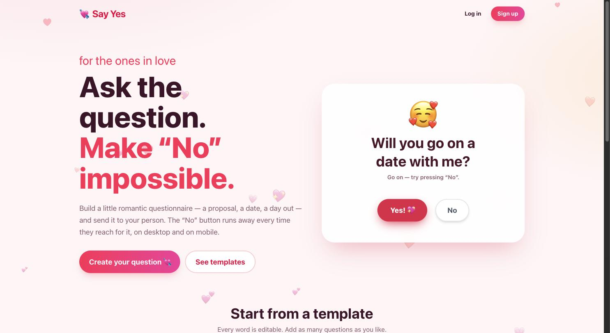
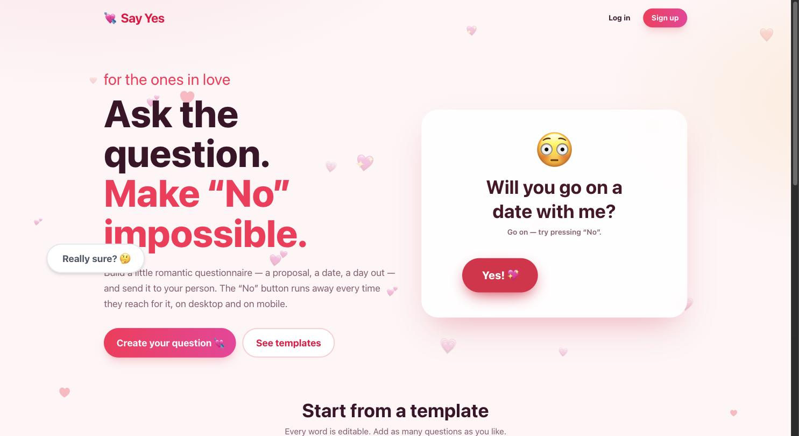

# Will You Say Yes? 💘

**Ask the question. Make "No" impossible.**

Build a romantic questionnaire (*Will you marry me?*, *Be my Valentine?*, *Day out with me?*), send the link, and watch them try to press **No**. The button runs away on hover (desktop) and on tap (mobile), and gets more desperate every time.

[](LICENSE)
[](https://nextjs.org)
[](https://firebase.google.com)
[](#contributing)

[](https://vercel.com/new/clone?repository-url=https%3A%2F%2Fgithub.com%2FSShehan716%2Fwill-you-say-yes&env=NEXT_PUBLIC_FIREBASE_API_KEY,NEXT_PUBLIC_FIREBASE_AUTH_DOMAIN,NEXT_PUBLIC_FIREBASE_PROJECT_ID,NEXT_PUBLIC_FIREBASE_STORAGE_BUCKET,NEXT_PUBLIC_FIREBASE_MESSAGING_SENDER_ID,NEXT_PUBLIC_FIREBASE_APP_ID&envDescription=Firebase%20web%20app%20config&project-name=will-you-say-yes)

| Before | After trying to press "No" |
| --- | --- |
|  |  |

> ⭐ If this made you smile (or helped you get a yes), **star the repo** so more people find it.

**Stack:** Next.js 15 (App Router) + Tailwind v4 on Vercel · Firebase Auth (email/password + Google) + Cloud Firestore.

## Features
- Register/login with a name and gender (boy / girl / rather not say); gender sets template wording ("girlfriend" or "boyfriend")
- 7 templates: marry me, day out, Valentine, romantic dinner, girlfriend/boyfriend, forgive me, custom
- Question types: **Yes/No** (runaway No), **Pick one**, **Date & time**, **Free text**. Up to 15 questions, reorderable
- 4 themes, live preview, envelope intro, heart confetti on yes
- Recipient doesn't need an account. Their answers, plus how many times they tried "No", show up on your dashboard
- Share via copy link, WhatsApp, or the native share sheet

## How the runaway button works (`src/components/RunawayButton.tsx`)
- `pointerenter` (mouse only) → jumps away before you can click
- `pointerdown` (touch/pen/mouse) → jumps away before a click can register
- `onClick` (keyboard Enter/Space) → also just jumps. A "No" answer is never recorded
- After the first escape it's portalled to `<body>` as `position: fixed`, so it can roam the whole viewport. It always lands at least ~160px away, never on the Yes button, and stays inside the screen when the viewport is resized

## Setup

### 1. Firebase
1. Create a project at <https://console.firebase.google.com>.
2. **Authentication → Sign-in method**: enable *Email/Password* and *Google*.
3. **Firestore Database → Create database** (production mode).
4. **Project settings → Your apps → Web app**: register an app and copy the config.
5. Deploy the security rules:
   ```bash
   npm i -g firebase-tools
   firebase login
   firebase use --add          # pick YOUR project (overrides the default in .firebaserc)
   firebase deploy --only firestore:rules
   ```
   `.firebaserc` points at the maintainer's project. Forks must run `firebase use --add`, or deploys will fail with a permission error.

### 2. Local
```bash
cp .env.example .env.local   # paste your Firebase config
npm install
npm run dev                  # http://localhost:3000
```

### 3. Vercel
1. Push this repo to GitHub and import it in Vercel. Next.js is auto-detected.
2. Add the six `NEXT_PUBLIC_FIREBASE_*` variables from `.env.example` under **Settings → Environment Variables**.
3. Deploy. Then in Firebase, go to **Authentication → Settings → Authorized domains** and add your `*.vercel.app` domain and any custom domain. Google sign-in fails without this.

## Data model
```
users/{uid}                       displayName, email, gender
proposals/{id}                    ownerId, ownerName, recipientName, template, theme,
                                  intro, questions[], finalMessage, createdAt, updatedAt
proposals/{id}/responses/{rid}    answers[], noAttempts, createdAt
```
Rules (`firestore.rules`): anyone with a link can `get` that proposal but can't list other people's proposals. Only the owner can edit or delete. Anyone can *create* a response with a validated shape, but only the owner can read responses.

## Known limitations
- Responses are written anonymously, so someone who has the link could spam answers. To lock that down, enable **Firebase App Check** (reCAPTCHA Enterprise) and enforce it on Firestore.
- Link previews (WhatsApp/iMessage) use a generic title on purpose, so they don't spoil the question.

## Contributing
PRs are welcome! Ideas: more templates, translations, music, GIF reactions, a countdown to the date. Fork the repo, create a branch, and open a pull request against `main` (direct pushes to `main` are blocked).

## License
[MIT](LICENSE) © SShehan716
